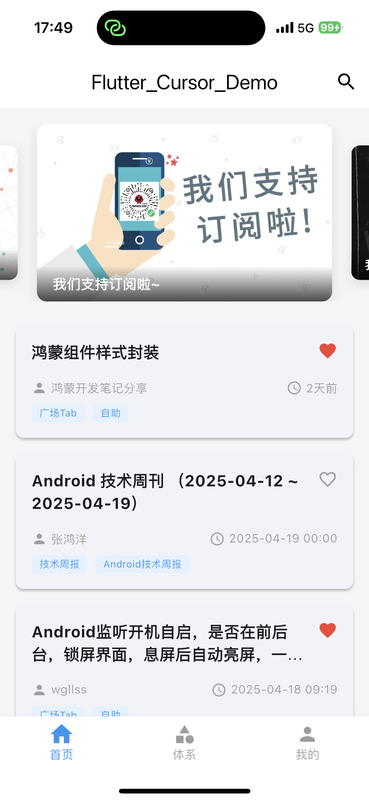
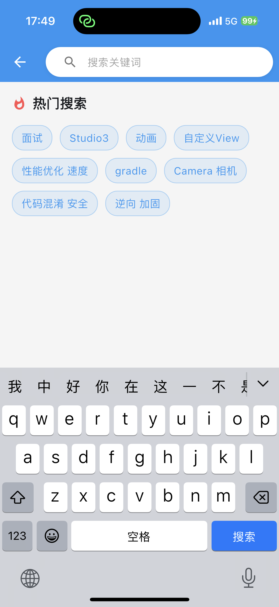
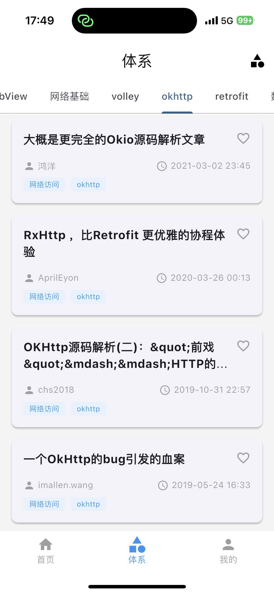
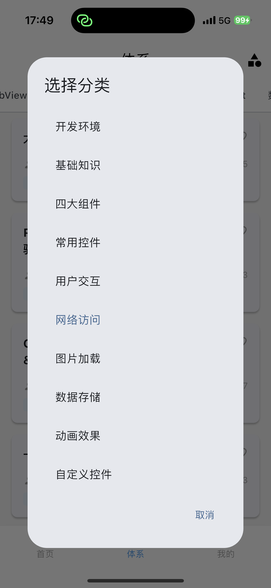
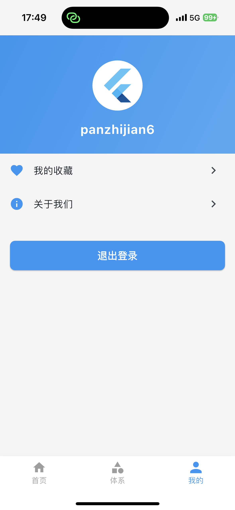

# Flutter Cursor Demo

<div align="center">


[](https://flutter.dev/)
[](https://dart.dev/)
[](LICENSE)
[](https://cursor.sh/)

**一个完全由 Cursor AI 自动生成的 Flutter 应用程序演示,不手动写一行代码**

</div>

## 📱 项目展示

<div align="center">
<table>
  <tr>
    <td></td>
    <td></td>
    <td></td>
  </tr>
  <tr>
    <td></td>
    <td></td>
  </tr>
</table>
</div>

## 🤖 关于此项目

**重要说明：此项目中的每一行代码都是由 [Cursor AI](https://cursor.sh/) 自动生成的，没有手动编写任何代码。**

这个项目是一个使用 Flutter 开发的移动应用程序，展示了 AI 辅助编程的强大能力。作为一个演示项目，它展示了现代移动应用程序开发的最佳实践和设计模式，包括：

- 高级 UI 组件和动画
- 响应式状态管理
- 网络请求和 API 集成
- 用户认证功能
- 缓存和本地存储
- 性能优化和错误处理

## ✨ 功能特点

- **精美的UI设计**：包括动画过渡、自定义组件和响应式布局
- **首页浏览**：展示文章列表和轮播图
- **文章系统**：按分类浏览内容
- **搜索功能**：支持关键词和作者搜索
- **用户系统**：登录、注册和个人中心
- **收藏功能**：支持文章收藏和管理
- **主题设计**：一致的视觉风格和用户体验

## 🧪 技术栈

- **Flutter**：UI 框架和跨平台开发
- **Provider**：状态管理
- **Go Router**：路由管理
- **Dio**：网络请求
- **SharedPreferences**：本地存储
- **EasyRefresh**：下拉刷新和加载更多
- **其他库**：flutter_screenutil, carousel_slider, webview_flutter 等

## 🏗️ 项目架构

项目采用 MVVM (Model-View-ViewModel) 架构模式，目录结构如下：

## 🚀 开始使用

### 前提条件

- Flutter SDK 3.27.3 或更高版本
- Dart SDK 3.6.1 或更高版本
- Android Studio / VS Code
- Android 或 iOS 设备/模拟器

### 安装步骤

1. 克隆仓库：
   ```bash
   git clone https://github.com/your_username/flutter_cursor_demo.git
   cd flutter_cursor_demo
   ```

2. 获取依赖：
   ```bash
   flutter pub get
   ```

3. 运行应用：
   ```bash
   flutter run
   ```

## 🔍 AI 生成过程

本项目完全由 Cursor AI 自动生成，开发过程包括：

1. **需求分析**：AI 解析项目需求
2. **架构设计**：确定项目结构和技术选型
3. **代码生成**：自动生成所有代码文件
4. **优化迭代**：根据需求变更优化代码

整个过程零人工编码干预，展示了 AI 辅助开发的潜力。

## 🌟 学习价值

本项目对以下人群具有学习价值：

- **Flutter 开发者**：学习现代 Flutter 应用架构和最佳实践
- **AI 研究者**：了解 AI 代码生成能力的现状
- **产品经理**：探索 AI 辅助开发如何加速产品开发流程
- **编程学习者**：通过 AI 生成的高质量代码学习 Flutter 开发

## 📋 未来计划

- 增加单元测试和集成测试
- 支持深色模式
- 添加国际化支持
- 优化应用性能

## 💰 支持作者

如果这个项目对您有所帮助，或者您欣赏这种 AI 辅助开发的尝试，可以考虑打赏支持作者继续创作更多优质内容！

每一份支持都是对我工作的莫大鼓励，也能帮助我投入更多时间改进项目和创造新的开源作品。

<div align="center">
<table>
  <tr>
    <td></td>
    <td></td>
  </tr>
  <tr>
    <td align="center">微信支付</td>
    <td align="center">支付宝</td>
  </tr>
</table>
</div>

您的支持将用于：
- 🚀 持续优化和完善此项目
- 📚 创造更多有价值的开源项目
- ☕ 为熬夜coding的我买一杯咖啡

感谢您的每一份支持与鼓励！❤️

## 📝 许可证

本项目采用 MIT 许可证 - 详情见 [LICENSE](LICENSE) 文件

## 🤝 致谢

- [Flutter](https://flutter.dev/)
- [Cursor AI](https://cursor.sh/)
- [WanAndroid API](https://www.wanandroid.com/blog/show/2)

---

<div align="center">

**喜欢这个项目？请给它一个 ⭐️！**

**这个项目展示了 AI 辅助编程的未来。**

[查看其他项目](https://github.com/your_username) · [报告 Bug](https://github.com/your_username/flutter_cursor_demo/issues) · [请求功能](https://github.com/your_username/flutter_cursor_demo/issues)

</div>
